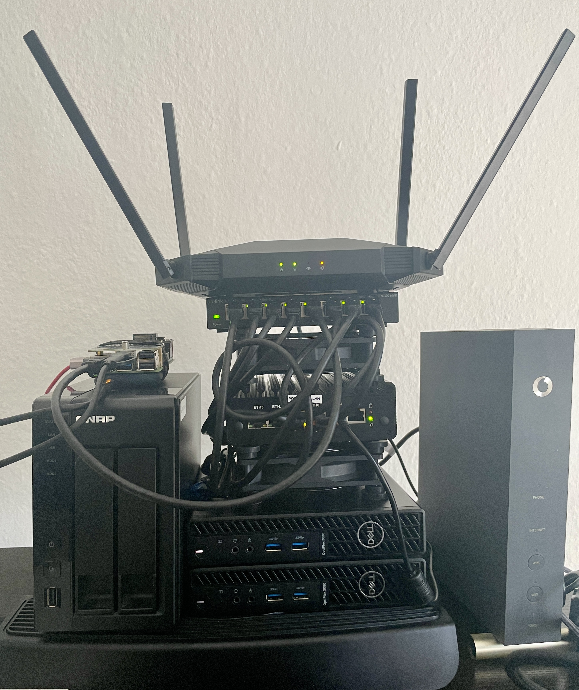

# HomeLab: Isolated Environment for Penetration Testing and Security Research
This is NOT a step by step guide but more like a reference architecture, its technical details and steps needed to create a HomeLab, how to do each step needs to be found on your own.
This HomeLab allows me to conduct IT-Security research by enabling experimentation with networks, tools and networking hardware.
The intention of my HomeLab is to provide me a flexible and unrestricted environment to help me practice, experiment, and test.
By building this setup, Im gaining hands-on experience with technologies and tools that I would not have access to in a virtual setting. This setup allows me to test tools, simulate attacks, monitor traffic, and much more.

## Purpose
* Create a safe and isolated environment for researching pentesting techniques. 
* Practice and apply networking concepts.
* Configure firewalls.
* Experiment with tools in a more controlled environment.
* Simulate a more real environment.
* Experiment with Network Hardware.

## Tools used

 - Laptop:
   - RAM 40GB(max) DDR5
   - SSD 1TB
   - Intel i7 12700H
   - OS Debian GNU/Linux 12 (Bookworm) 

 - Software:
   - Proxmox 
   - Metasploitable3
   - SecurityOnion 
   - OPNsense 
   - Parrot
   - Kali Linux(arm64)
   - VirtualBox

 - Hardware:
   - ISP modem
   - 2 servers
   - RaspberryPi 5 
   - QNAP NAS(bad purchase)
   - firewall 
   - access point
   - managed switch (for vlans)

## Setup Reference
